<h1 align="center">👋 Hey there, I'm Baran!</h1>
<h3 align="center">Content Creator | Programmer | Coder from Türkiye 🇹🇷</h3>

  
  
  

---

## About Me

Welcome to my page! Looks like you want to learn more about me. 
I'm a **content creator** on YouTube and other platforms. When I'm not making content, I'm usually diving into coding, game development, or just vibing online. I love creating fun projects and learning new things along the way!

## 🛠️ Tech Stack & Tools

**Languages & Tools I currently use:**
 

**What I want to learn next:**
 

---

## 📊 GitHub & Coding Stats

  
  

---

## 💬 A little message for you:

> *I don't know how life is going for you right now...*  
> *But if it's rough, just remember: **it's okay**. Take your time, relax, and believe in the future.*  
> *You're strong enough to make your dreams come true, **never give up**.*  
> *The world is big, your time is precious, and **you matter**.* 💚
